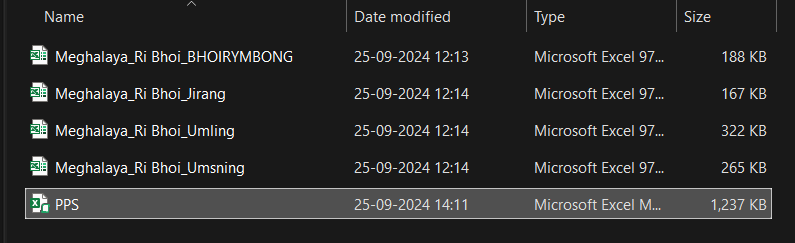

```{r setup-rural, include=FALSE}
knitr::opts_chunk$set(echo = TRUE, warning = FALSE, message = FALSE,eval = FALSE)
```

# **Cluster selection in Rural areas**

This section discusses the implementation of the app for cluster selection in rural areas.

### Basic Idea

```{=html}
<div style="text-align: center;">
<iframe src="PPS_Steps.pdf" width="80%" height="400px">
</iframe>
</div>
```


### File structure

```{=html}
<div class="tree">

State xyz /
├── <span class="highlight">Cluster Allocation.xlsm</span>
├── District a /
│   ├── <span class="highlight">PPS.xlsm</span>
│   ├── Block 1 data.xls
│   ├── Block 2 data.xls
│   ├── Block 3 data.xls
│   ├── :
│   └── :
├── District b /
├── District c /
├── :
└── :

</div>
```

<code style="color:red;">Cluster Allocation.xlsm</code> is present in all the state folders, and <code style="color:red;">PPS.xlsm</code> is present in all the district folders under each state. <code style="color:red;">Block 1 data.xls</code> contains the list of Gram Panchayats as shown in below.

```{=html}
<div class="image-container" style="text-align: center">
  
</div>
```

<br><br>

### Functions

```{=html}
<div class="tree">

Cluster ALLocation.xlsm
├── Module1
│   ├── <span class="highlight">func ALLinALL()</span>
│   └── func FilterByColor(PPSWorkbook As Workbook)
└── Module2
    └── <span class="highlight">func CalculateProportions()</span>

PPS.xlsm
├── Module1
│   └── func CopySheetsFromAllWorkbooks()
├── Module2
│   └── <span class="highlight">func TableCooker()</span>
├── Module3
│   └── func CumulativeSumWithFormula()
├── Module4
│   └── <span class="highlight">func RandomSelector()</span>
└── Module5
    └── func LoadTotal()
</div>

<span class="highlight">*</span> highlighted functions are the main tasks where the other functions are subtasks
```

### Program Flow chart

```{r, out.width="40%", fig.align="center", eval=TRUE}
knitr::include_graphics("flow-chart2.svg")
```

## Overview

The ALLinALL macro implements a sophisticated three-phase data processing and sampling system designed for multi-directory statistical analysis. The system processes Excel files across multiple folders, consolidates data, calculates proportional distributions, and performs systematic sampling with multiple iterations.

------------------------------------------------------------------------

## **PHASE 1: Data Collection and Consolidation** <br>(First Pass)

### Purpose

This phase discovers and processes data files across directory structures, creating a unified dataset for sampling procedure.

### Detailed Procedures

#### 1.1 Directory Scanning and Setup

``` vba
currentDirectory = ThisWorkbook.Path
dirName = Mid(currentDirectory, InStrRev(currentDirectory, "\") + 1)
```

-   **Function**: Identifies the current working directory and extracts just the directory name

-   **Output**: Creates a base reference for grouping data by location

-   **Data Flow**: Directory name goes to Column A of the main worksheet

    

#### 1.2 Folder Iteration and File Discovery

``` vba
For Each folder In fileSystem.GetFolder(currentDirectory).SubFolders
    PPSPath = folder.Path & "\" & PPSFile
```

-   **Function**: Systematically searches each subfolder for PPS.xlsm files
-   **Logic**: Uses FileSystemObject for robust file system navigation
-   **Error Handling**: Checks file existence with `Dir(PPSPath) <> ""`
-   **Data Flow**: Folder names populate Column B of main worksheet

::: {align="center"}  :::

#### 1.3 TableCooker Execution (Core Data Processing)

When a PPS.xlsm file is found, the system executes the \``TableCooker`\` macro:

##### Sub-Process: CopySheetsFromAllWorkbooks

``` vba
fileName = Dir(folderPath & "*.xls")
Do While fileName <> ""
    For Each ws In sourceWorkbook.Sheets
        ws.Copy After:=currentWorkbook.Sheets(currentWorkbook.Sheets.Count)
```

-   **Function**: Discovers and imports all Excel files (.xls) within each folder

    

-   **Logic**: Creates a comprehensive dataset by merging multiple source files <br><br>

    ::: {align="center"}
    | Sr. No. | Gram Panchayat | TOTAL | C.P | Selection |
    |--------:|----------------|------:|:---:|:---------:|
    |       1 | BIRSIEJ        |   750 |     |           |
    |       2 | I.C.A.R.       |   836 |     |           |
    |       3 | INGSAW         |  1184 |     |           |
    |       4 | ITPATUNG       |   131 |     |           |
    |       5 | ITSOHPAIR      |   710 |     |           |
    :::

    <br><br>

-   **Exclusion Rule**: Skips the current workbook to avoid circular references

##### Sub-Process: Data Standardization

``` vba
ws.Rows("1:6").Delete        ' Remove headers
ws.Rows(lastRow - 1 & ":" & lastRow).Delete  ' Remove footers
```

-   **Function**: Standardizes data structure across different source files
-   **Rationale**: Removes inconsistent header/footer rows that vary between files
-   **Result**: Clean, uniform data ready for statistical processing

##### Sub-Process: Data Consolidation

``` vba
usedRange.Copy
combinedSheet.Cells(lastTargetRow, 1).PasteSpecial Paste:=xlPasteValues
```

-   **Function**: Merges all processed sheets into a single "CombinedData" sheet

-   **Method**: Sequential appending maintains data integrity

-   **Memory Management**: Uses PasteSpecial with values only to optimize performance

    ::: {align="center"}
    
    :::


#### 1.4 Statistical Preprocessing

##### Cumulative Sum Calculation

``` vba
Range("G2").Value = Range("F2").Value
.Range("G3", "G" & ws.Rows.Count).Formula = "=" & .Cells(3, "F").Address & "+" & .Cells(2, "G").Address
```

-   **Function**: Creates running totals essential for systematic sampling

    

##### Total Extraction

``` vba
total = ws.Cells(lastRow, "G").Value
ws.Range("O1").Value = total
```

-   **Function**: Captures the final cumulative total for each dataset

-   **Storage**: Places total in cell O1 for cross-reference

    

-   **Data Flow**: This total becomes the basis for proportional calculations

    

### Phase 1 Output

-   **Column A**: Directory name (grouping variable)
-   **Column B**: Folder name (district identifier)
-   **Column C**: Total values from each folder's processed data
-   **Result**: Master inventory of all available data sources with their statistical weights

------------------------------------------------------------------------

## **PHASE 2: Proportional Analysis and Sampling Preparation**

### Purpose

Calculates proportional distributions and determines sampling allocations based on collected data.

### Detailed Procedures

#### 2.1 User Input Integration - total clusters requested

``` vba
userValue = Application.InputBox("Enter Total No. of clusters:", Type:=1)
```

-   **Integration**: Multiplies proportions to determine actual number of clusters for each district

#### 2.2 CalculateProportions Function

##### Proportion Calculation

``` vba
ws.Cells(j, "D").Value = ws.Cells(j, "C").Value / sumC
ws.Cells(j, "E").Value = ws.Cells(j, "D").Value * userValue
```

-   **Column D**: Relative proportion (folder total ÷ directory total)

-   **Column E**: Absolute allocation (proportion × total clusters requested)

-   **Column F**: Rounded off values of `Column E`

    

### Phase 2 Output

-   **Column D**: Proportional weights (0-1 scale)
-   **Column E**: Actual cluster counts for sampling
-   **Purpose**: Provides sampling parameters for Phase 3 execution

------------------------------------------------------------------------

## **PHASE 3: Systematic Sampling and Results Generation (Second Pass)**

### Purpose

Executes multiple iterations of systematic sampling across all data sources and generates comprehensive results.

### Detailed Procedures

#### 3.1 Sampling Preparation

``` vba
Set PPSWorkbook = Workbooks.Open(PPSPath)
valueForMacro = ws.Cells(rowCounter, 5).Value
PPSWorkbook.Sheets(1).Range("O2").Value = valueForMacro
```

-   **Function**: Reopens each PPS file for sampling

-   **Parameter Passing**: Transfers calculated sample sizes (Column E) to O2

-   **Setup**: Prepares the sampling environment with correct parameters

    

#### 3.2 Results Sheet Creation

``` vba
Set wsNew = ThisWorkbook.Sheets.Add(After:=ThisWorkbook.Sheets(ThisWorkbook.Sheets.Count))
wsNew.Name = folderName
```

-   **Function**: Creates dedicated output sheets for each folder

-   **Organization**: Maintains clear separation of results by data source

-   **Naming**: Uses folder names for easy identification

    ::: {align="center"}
     
    :::

#### 3.3 RandomSelector Algorithm (Core Sampling Engine)

##### Initialization and Cleanup

``` vba
ws.Columns("B:B").Interior.Color = xlNone
Range("O5:O20").Delete Shift:=xlUp
userInput = ws.Range("O2").Value
```

-   **Reset**: Clears previous color coding and random values
-   **Parameter Loading**: Gets sample size from Phase 2 calculations
-   **Preparation**: Sets up clean environment for new sampling iteration

##### Sampling Interval Calculation

``` vba
total = ws.Cells(lastRow, "G").Value
ws.Range("O3").Value = total / userInput
O1Value = ws.Range("O3").Value
```

-   **Function**: Calculates systematic sampling interval

-   **Formula**: Total population ÷ desired sample size

    

##### Random Start Generation and Selection

``` vba
rand_start = Rnd() * O1Value
Do While counter < userInput
    For i = 2 To lastRow
        If ws.Cells(i, "G").Value > rand_start Then
            ws.Cells(i, "B").Interior.Color = RGB(255, 255, 0) ' Yellow
            rand_start = rand_start + O1Value
            counter = counter + 1
```

-   **Random Start**: Generates random starting point within first interval
-   **Systematic Selection**: Adds interval size to select subsequent items
-   **Visual Marking**: Colors selected rows yellow for identification
-   **Iteration Control**: Continues until desired sample size reached

#### 3.4 Multi-Iteration Processing

``` vba
For iterationcounter = 1 To repeatTimes
    Application.Run "'" & PPSWorkbook.Name & "'!RandomSelector"
    PPSWorkbook.Sheets(1).Range("M:O").Copy wsNew.Cells(1, pasteMOColumn)
```

-   **Function**: Runs multiple independent sampling iterations
-   **Output Management**: Places results side-by-side for comparison

#### 3.5 FilterByColor and Data Extraction

``` vba
ws.Range("A1:H" & lastRow).AutoFilter field:=2, Criteria1:=RGB(255, 255, 0), Operator:=xlFilterCellColor
Set visibleRange = filteredRange.SpecialCells(xlCellTypeVisible)
visibleRange.Copy wsNew.Cells(1, pasteTableColumn)
```

-   **Function**: Isolates selected (yellow) rows from the dataset

-   **Method**: Uses Excel's AutoFilter with color criteria

-   **Extraction**: Copies only visible (selected) rows to results

-   **Layout**: Arranges multiple iterations horizontally for analysis

    

    {width="690" height="166"}

------------------------------------------------------------------------
