```{r setup-urban, include=FALSE}
knitr::opts_chunk$set(echo = TRUE, warning = FALSE, message = FALSE,eval = FALSE)
```

# **Cluster selection in Urban areas**

### Program Flow chart

```{r, out.width="50%", fig.align="center", eval=TRUE}

```

```{r}
# Install Python packages via pip
system("pip install requests pandas geopy openpyxl geopandas matplotlib numpy reportlab PyPDF2")


# Download files from Google Drive using gdown
system("gdown https://drive.google.com/uc?id=1BQnzVmLHCfw84z-RnfWbdgcpNIBNgKWc")
system("gdown https://drive.google.com/uc?id=18L5b_ya_YxoD7-PCfw8ftzeXU0jh6BIy")

# Make directory
dir.create("GIS map temp", showWarnings = FALSE)

# Unzip file
unzip("district_boundries.zip", exdir = "GIS")

# Remove zip file
unlink("district_boundries.zip")

# Remove folder
unlink("sample_data", recursive = TRUE)

```

## Import Libraries and Utility Functions

This section imports all necessary libraries for data processing, file operations, geographic analysis, visualization, and PDF generation. It also includes utility functions for:

-   **File Download**: Download files from URLs with error handling and progress tracking
-   **Random Filename Generation**: Create unique filenames to avoid conflicts during file operations

**Key Libraries:** - `pandas`, `numpy`: Data manipulation and analysis - `geopandas`, `geopy`: Geographic data processing - `matplotlib`: Data visualization - `reportlab`, `PyPDF2`: PDF generation and manipulation - `requests`: HTTP requests for file downloads - `openpyxl`: Excel file operations

```{python}
import requests
import os
import random
import string
import pandas as pd
import geopy
from openpyxl import Workbook
import geopandas as gpd
import matplotlib.pyplot as plt
import numpy as np
from collections import Counter
import warnings
from reportlab.lib import colors
from reportlab.lib.pagesizes import A4
from reportlab.lib.units import inch
from reportlab.pdfgen import canvas
from reportlab.pdfbase import pdfmetrics
from reportlab.pdfbase.ttfonts import TTFont
from reportlab.platypus import Table, TableStyle, SimpleDocTemplate
from PyPDF2 import PdfWriter, PdfReader
from IPython.display import display

# Suppress specific warnings to keep output clean
warnings.filterwarnings('ignore')

def download_file(url, folder_path, filename):
    """
    Download a file from URL and save it to specified folder
    Returns: filepath if successful, None if failed
    """
    try:
        # Create directory if it doesn't exist
        if not os.path.exists(folder_path):
            os.makedirs(folder_path)
            print(f"✓ Created directory: {folder_path}")

        # Download file with streaming to handle large files
        response = requests.get(url, stream=True)
        response.raise_for_status()

        filepath = os.path.join(folder_path, filename)
        with open(filepath, 'wb') as file:
            for chunk in response.iter_content(chunk_size=8192):
                file.write(chunk)

        print(f"✓ File downloaded successfully: {filepath}")
        return filepath
    except requests.exceptions.RequestException as e:
        print(f"✗ Error downloading file: {e}")
        return None

def generate_random_filename(length=10, extension=".xlsx"):
    """Generate a random filename to avoid conflicts"""
    characters = string.ascii_letters + string.digits
    random_filename = ''.join(random.choice(characters) for _ in range(length)) + extension
    return random_filename
```

## Data Download and Initial Processing

This step handles the initial data acquisition and preprocessing:

**Key Operations:**

1\. **Download Data**: Downloads UFS (Urban Frame Survey) data from MOSPI website for Goa state

2\. **Load Excel File**: Reads the downloaded Excel file into a pandas DataFrame

3\. **Clean Headers**: Removes metadata rows and assigns meaningful column names

4\. **Extract State Info**: Captures state name and code for later use

**Data Structure:**

\- `S_Code`, `S_Name`: State code and name

\- `D_Code`, `District`: District code and name\
- `T_Code`, `Town`: Town code and name

\- `IV_Unit_No`, `Block_No`: Investigation unit and block identifiers

\- `No_of_Households`: Number of households in each block

This creates the foundation dataset for cluster sampling analysis.

```{python}
# =============================================================================
# STEP 1: DATA DOWNLOAD AND INITIAL PROCESSING
# =============================================================================
print("="*80)
print("STEP 1: DOWNLOADING AND LOADING DATA")
print("="*80)

url = "https://mospi.gov.in/sites/default/files/publication_reports/UFS/UFS_30_Goa7112023.xlsx"
filename = generate_random_filename()
folder_path = "states"

# Download the Excel file
download_file(url, folder_path=folder_path, filename=filename)

# Load and process the Excel file
filepath = os.path.join(folder_path, filename)
df = pd.read_excel(filepath)

print(f"\nInitial data shape: {df.shape}")
print(f"Initial columns: {list(df.columns)}")

# Remove first 2 rows (likely headers) and limit to first 10 columns
df = df.iloc[2:]
df = df.iloc[:, :10]

# Assign meaningful column names
new_column_names = ['S_Code', 'S_Name', 'D_Code', 'District', 'T_Code', 'Town', 'Code', 'IV_Unit_No', 'Block_No', 'No_of_Households']
df.columns = new_column_names

# Extract state information
state_name = df.iloc[0, 1]
state_code = df.iloc[0, 0]

print(f"\n State Name: {state_name}")
print(f" State Code: {state_code}")
print(f"Processed data shape: {df.shape}")
print(f"\nSample of processed data:")
print(df.head())
```

🏛️ State Name: Goa 🏛️ State Code: 30 📊 Processed data shape: (1592, 10)

**Preprocessed data set:**

| S_Code | S_Name | D_Code | District | T_Code | Town | IV_Unit_No | Block_No | No_of_Households |
|--------|--------|--------|--------|--------|--------|--------|--------|--------|
| 30 | Goa | 01 | North Goa | 001 | Aldona | 17 | 0001 | 63 |
| 30 | Goa | 01 | North Goa | 001 | Aldona | 17 | 0001 | 69 |
| 30 | Goa | 01 | North Goa | 001 | Aldona | 17 | 0001 | 83 |
| 30 | Goa | 01 | North Goa | 001 | Aldona | 17 | 0001 | 89 |
| 30 | Goa | 01 | North Goa | 001 | Aldona | 17 | 0001 | 90 |

## District Selection and Filtering

This step allows users to select specific districts for analysis:

**Process:**

1\. **User Input**: Prompts user to enter district codes separated by spaces

2\. **Data Filtering**: Filters the main dataset to include only selected districts

3\. **Validation**: Shows which districts are included in the filtered dataset

**Purpose:**

\- Enables targeted analysis for specific geographical areas

\- Reduces dataset size for more focused sampling

\- Allows comparison between different district combinations

**Output:** Filtered dataset containing only the selected districts with summary statistics.

```{python}
# =============================================================================
# STEP 2: DISTRICT SELECTION AND FILTERING
# =============================================================================
print("\n" + "="*80)
print("STEP 2: DISTRICT SELECTION AND FILTERING")
print("="*80)

# Get user input for district codes
D_Code_list = ["01","02"]
print(f"Selected district codes: {D_Code_list}")

# Filter data for selected districts
filtered_df = df[df['D_Code'].isin(D_Code_list)]
print(f"Filtered data shape: {filtered_df.shape}")

# Show unique districts in filtered data
unique_districts = filtered_df[['D_Code', 'District']].drop_duplicates()
print(f"\n Districts in filtered data:")
display(unique_districts.to_string(index=False))
```

**Selected district codes:** `['01', '02']`\
**Filtered data shape:** `(1592, 10)`

| D_Code | District  |
|--------|-----------|
| 01     | North Goa |
| 02     | South Goa |

## Exclusion Logic

This step implements quality control by removing Investigation Units (IV Units) with insufficient data for the sampling process

**Quality Criteria:** - **Threshold**: IV Units with fewer than 20 blocks are considered insufficient for reliable sampling - **Analysis Level**: Examines each Town-IV Unit combination within districts

**Process:**

1\. **Frequency Analysis**: Counts blocks per IV Unit in each town

2\. **Threshold Application**: Identifies IV Units with \<20 blocks

3\. **Exclusion Decision**: Removes insufficient IV Units based on `Excluder` parameter

4\. **Data Cleaning**: Creates filtered dataset with only sufficient IV Units

**Output:** Clean dataset with only statistically viable IV Units for cluster sampling.

```{python}
# =============================================================================
# STEP 3: EXCLUSION LOGIC - REMOVE IV UNITS WITH <20 BLOCKS
# =============================================================================
print("\n" + "="*80)
print("STEP 3: APPLYING EXCLUSION LOGIC")
print("="*80)

# Set exclusion parameter (1 to enable exclusion, 0 to disable)
Excluder = 1  # Set to 1 to enable exclusion, 0 to disable

excluded_combinations_by_district = {}

print("🔍 Analyzing IV Units by district...")
for district_code, group in filtered_df.groupby('D_Code'):
    print(f"\n📍 Processing District: {district_code}")

    # Count frequency of each T_Code + IV_Unit_No combination
    er = group.groupby(['T_Code', 'IV_Unit_No']).size().reset_index(name='Frequency')
    print(f"   📊 Total T_Code + IV_Unit_No combinations: {len(er)}")

    # Find combinations with less than 20 blocks
    excluded_combinations = er[er['Frequency'] < 20][['T_Code', 'IV_Unit_No']]
    print(f"   ❌ Combinations with <20 blocks: {len(excluded_combinations)}")

    # Skip if all combinations would be excluded and Excluder is 0
    if len(excluded_combinations) == er.shape[0] and Excluder == 0:
        print(f"   ⚠️  All combinations would be excluded, skipping district {district_code}")
        continue

    if not excluded_combinations.empty:
        excluded_combinations_by_district[district_code] = [tuple(x) for x in excluded_combinations.to_records(index=False)]
        print(f"   🚫 Excluded combinations: {excluded_combinations_by_district[district_code]}")

# Create a set of all excluded combinations for filtering
excluded_combinations = {
    (d_code, t_code, iv_unit_no)
    for d_code, combinations in excluded_combinations_by_district.items()
    for t_code, iv_unit_no in combinations
}

print(f"\n📊 Total excluded combinations across all districts: {len(excluded_combinations)}")

# Apply exclusion filter
filtered_df1 = filtered_df[
    ~filtered_df.set_index(['D_Code', 'T_Code', 'IV_Unit_No']).index.isin(excluded_combinations)
].reset_index(drop=True)

print(f"📊 Data shape after exclusions: {filtered_df1.shape}")
print(f"📊 Rows removed: {len(filtered_df) - len(filtered_df1)}")
```

::: results
🔍 Analyzing IV Units by district...

📍 **Processing District: 01**\
📊 Total T_Code + IV_Unit_No combinations: 56\
❌ Combinations with \<20 blocks: 42\
🚫 Excluded combinations:\
('001', '0001'), ('002', '0001'), ('007', '0001'), ('008', '0001'),\
('010', '0001'), ('011', '0001'), ('012', '0001'), ('013', '0001'),\
('014', '0002'), ('014', '0003'), ('015', '0001'), ('016', '0001'),\
('016', '0002'), ('016', '0003'), ('016', '0005'), ('017', '0001'),\
('019', '0001'), ('021', '0001'), ('022', '0001'), ('023', '0001'),\
('024', '0001'), ('025', '0001'), ('026', '0001'), ('027', '0001'),\
('028', '0001'), ('029', '0001'), ('030', '0001'), ('031', '0001'),\
('032', '0001'), ('033', '0001'), ('034', '0001'), ('035', '0001'),\
('038', '0001'), ('039', '0001'), ('040', '0001'), ('042', '0001'),\
('046', '0001'), ('048', '0001'), ('049', '0001'), ('050', '0001'),\
('051', '0001'), ('052', '0001')

📍 **Processing District: 02**\
📊 Total T_Code + IV_Unit_No combinations: 29\
❌ Combinations with \<20 blocks: 11\
🚫 Excluded combinations:\
('001', '0001'), ('002', '0001'), ('005', '0001'), ('009', '0002'),\
('010', '0002'), ('011', '0001'), ('014', '0001'), ('015', '0001'),\
('016', '0001'), ('017', '0001'), ('018', '0001')

📊 **Total excluded combinations across all districts:** 53\
📊 **Data shape after exclusions:** (890, 10)\
📊 **Rows removed:** 702
:::

### Why Exclusion was done?

Here Column 1 represents the `IV units` and Column 2 represents the number of blocks in a IV unit.\


Although IV units are defined as holding 20 to 40 blocks, in many cases they contain far fewer blocks, which may result in an insufficient number of blocks for sampling.

### Will this exclusion process be avoided in some cases?

Yes, in some cases the exclusion process completely eliminates all the IV units in a district, making it impossible to carry out sampling for that district under the general strategy. This occurs when all the IV units have fewer than 20 blocks, and the number of blocks is quite unpredictable—sometimes even as low as one block per IV unit. Therefore, to retain such districts, the exclusion process is avoided."

However, It is a very rare case.

## Cluster Calculation and Proportional Allocation

This step implements the core statistical methodology for cluster sampling:

**Sampling Strategy:**

1\. **IV unit Count**: Counts unique IV Units per district

2\. **Proportional Allocation**: Distributes target clusters based on district size with respect to the number of IV units

**Key Calculations:**

\- **District Proportion** = IV Units in District / Total IV Units

\- **Allocated Clusters** = Target Clusters × District Proportion

\- **Minimum Allocation**: Each district gets at least 1 cluster (+1 adjustment)

**User Input:** Total number of clusters to be selected for the survey

**Output:** District-wise cluster allocation plan with verification totals.

```{python}
# =============================================================================
# STEP 4: CLUSTER CALCULATION AND ALLOCATION
# =============================================================================
print("\n" + "="*80)
print("STEP 4: CLUSTER CALCULATION AND ALLOCATION")
print("="*80)

# Count unique IV units per district and town
g = filtered_df1.iloc[:, :8].groupby(by=["D_Code", "T_Code"])[['IV_Unit_No']].nunique()
print("🔢 IV Units per District-Town combination:")
print(g.head(10))

# Sum up total clusters per district
unique_iv_unit_counts = g.groupby(by=["D_Code"]).sum()
print(f"\n📊 Total IV Units per district:")
print(unique_iv_unit_counts)

# Calculate proportions
unique_iv_unit_counts_proportion = unique_iv_unit_counts / unique_iv_unit_counts.sum()
unique_iv_unit_counts['Proportion'] = unique_iv_unit_counts_proportion

print(f"\n📊 District proportions:")
print(unique_iv_unit_counts[['IV_Unit_No', 'Proportion']])

# Get total number of clusters from user
num_clusters = int(input("Enter the total number of clusters to select: "))
print(f"🎯 Target total clusters: {num_clusters}")

# Allocate clusters proportionally to each district
unique_iv_unit_counts['No_of_Cluster'] = (unique_iv_unit_counts_proportion * num_clusters)
unique_iv_unit_counts['No_of_Cluster'] = unique_iv_unit_counts['No_of_Cluster'].apply(int) + 1

print(f"\n📊 Cluster allocation per district:")
print(unique_iv_unit_counts[['IV_Unit_No', 'Proportion', 'No_of_Cluster']])

# Add district names to results
district_names = df[['D_Code', 'District']].drop_duplicates()
result = pd.merge(unique_iv_unit_counts, district_names, on='D_Code', how='left')
result = result[['D_Code', 'District', 'IV_Unit_No', 'Proportion', 'No_of_Cluster']]

print(f"\n🎯 Final cluster allocation:")
print(result.to_string(index=False))

# Verify total allocated clusters
total_allocated = result['No_of_Cluster'].sum()
print(f"\n✅ Total clusters allocated: {total_allocated}")
print(f"🎯 Target clusters: {num_clusters}")
print(f"📊 Difference: {total_allocated - num_clusters}")
```

📊 **Total IV Units per district**

| D_Code | IV_Unit_No |
|--------|------------|
| 01     | 14         |
| 02     | 18         |

📊 **District proportions**

| D_Code | IV_Unit_No | Proportion |
|--------|------------|------------|
| 01     | 14         | 0.4375     |
| 02     | 18         | 0.5625     |

🎯 **Target total clusters:** 131

🎯 **Final cluster allocation**

| D_Code | District  | IV_Unit_No | Proportion | No_of_Cluster |
|--------|-----------|------------|------------|---------------|
| 01     | North Goa | 14         | 0.4375     | 58            |
| 02     | South Goa | 18         | 0.5625     | 74            |

✅ **Total clusters allocated:** 132\
🎯 **Target clusters:** 131\
📊 **Difference:** 1

## Utility Functions for Report Generation

This section defines helper functions for creating professional output reports:

**Excel Generation Functions:** - `extract_clusters_to_excel()`: Creates multi-sheet Excel workbooks with one sheet per district - Formats data with proper headers and structure

**PDF Generation Functions:** - `add_text_page()`: Adds formatted text content to PDF documents - `create_table_pdf()`: Generates professional tables with styling - Handles page breaks and font formatting

**Data Formatting Functions:** - `format_excluded_combinations()`: Creates readable summaries of excluded IV Units - Provides clear documentation of data quality decisions

**Purpose:** These functions enable automated generation of professional reports for survey planning and documentation, ensuring consistent formatting and comprehensive coverage of sampling decisions.

```{python}
# =============================================================================
# UTILITY FUNCTIONS FOR EXCEL AND PDF GENERATION
# =============================================================================

def extract_clusters_to_excel(selected_clusters, output_file):
    """Create Excel file with separate sheets for each district"""
    workbook = Workbook()
    workbook.remove(workbook.active)  # Remove default sheet

    for district_code, df in selected_clusters.items():
        if not df.empty:
            sheet_name = f"District_{district_code}"
            worksheet = workbook.create_sheet(title=sheet_name)
            # Add headers
            worksheet.append(list(df.columns))
            # Add data
            for row in df.values.tolist():
                worksheet.append(row)

    workbook.save(output_file)
    print(f"✅ Excel file created: {output_file}")

def add_text_page(pdf_canvas, text):
    """Add text content to PDF canvas"""
    pdf_canvas.setFont("CourierNew", 12)
    text_lines = text.split('\n')
    y_position = 800

    for line in text_lines:
        if y_position < 50:
            pdf_canvas.showPage()
            pdf_canvas.setFont("CourierNew", 12)
            y_position = 800
        pdf_canvas.drawString(72, y_position, line)
        y_position -= 14

    pdf_canvas.showPage()

def create_table_pdf(df, output_path):
    """Create PDF with table from DataFrame"""
    doc = SimpleDocTemplate(output_path, pagesize=A4)
    table_data = [df.columns.tolist()] + df.values.tolist()
    table = Table(table_data)

    style = TableStyle([
        ('BACKGROUND', (0, 0), (-1, 0), colors.grey),
        ('TEXTCOLOR', (0, 0), (-1, 0), colors.whitesmoke),
        ('ALIGN', (0, 0), (-1, -1), 'CENTER'),
        ('FONTNAME', (0, 0), (-1, 0), 'CourierNew'),
        ('FONTNAME', (0, 1), (-1, -1), 'CourierNew'),
        ('BOTTOMPADDING', (0, 0), (-1, 0), 12),
        ('BACKGROUND', (0, 1), (-1, -1), colors.white),
        ('GRID', (0, 0), (-1, -1), 1, colors.black),
    ])

    table.setStyle(style)
    doc.build([table])

def format_excluded_combinations(excluded_dict):
    """Format excluded combinations for display"""
    if not excluded_dict:
        return "No IV Units were excluded based on the frequency criteria.\n"

    formatted_text = "District wise excluded IV Units:\n\n"
    for district, exclusions in excluded_dict.items():
        formatted_text += f"District Code: {district}\n"
        formatted_text += "Town_Code   || IV_Unit_No\n"
        formatted_text += "-" * 25 + "\n"
        for town_code, iv_unit_no in exclusions:
            formatted_text += f"{town_code:<10} || {iv_unit_no}\n"
        formatted_text += "\n"
    return formatted_text
```

::: results
📋 **RESULT SUMMARY**

-   **State Name:** Goa\
-   **State Code:** 30\
-   **District Codes:** 01, 02\
-   **Total Clusters Requested:** 131\
-   **Total Clusters Allocated:** 132\
-   **Exclusion Applied:** Yes
:::

------------------------------------------------------------------------

📊 **Cluster Allocation by District**

| D_Code | District  | IV_Unit_No | Proportion | No_of_Cluster |
|--------|-----------|------------|------------|---------------|
| 01     | North Goa | 14         | 0.4375     | 58            |
| 02     | South Goa | 18         | 0.5625     | 74            |

## Result Summary and Sampling Preparation

This step creates a comprehensive summary of the sampling plan and prepares for execution:

**Summary Components:**

1\. **Metadata**: State name, state code, selected districts

2\. **Allocation Summary**: Target vs. allocated clusters

3\. **Quality Control**: Documentation of exclusions applied

4\. **District Breakdown**: Detailed allocation table

**Iteration Setup:**

\- **Multiple Samples**: Allows generation of multiple independent samples

\- **Reproducibility**: Each iteration creates a different random sample

```{python}
# =============================================================================
# STEP 5: PREPARE RESULT SUMMARY
# =============================================================================
print("\n" + "="*80)
print("STEP 5: PREPARING RESULT SUMMARY")
print("="*80)

result_string = []
result_string.append('\n\nRESULT SUMMARY')
result_string.append(f'State Name: {df.iloc[0, 1]}')
result_string.append(f'State Code: {df.iloc[0, 0]}')
result_string.append(f'District Codes: {" ".join(D_Code_list)}')
result_string.append(f'Total Clusters Requested: {num_clusters}')
result_string.append(f'Total Clusters Allocated: {total_allocated}')
result_string.append(f'Exclusion Applied: {"Yes" if Excluder else "No"}')
result_string.append('\n' + '-'*55)
result_string.append(result.to_string(index=False))

final_result = '\n'.join(result_string)
print(final_result)

# Get number of sample iterations from user
multiplier = int(input("Enter number of sample iterations to generate (usually 1): ") or "1")
print(f"🔄 Will generate {multiplier} independent sample(s)")
```

## Random Cluster Sampling Implementation

### Two-Stage Sampling Process

**Stage 1: IV Unit Selection**\
- Random selection of IV Units from each district\
- Uses allocated cluster counts from Step 4\
- Implements replacement logic when needed

**Stage 2: Block Selection**\
- Within selected IV Units, randomly samples UFS blocks\
- Ensures actual sample size matches allocation

------------------------------------------------------------------------

### Procedure for Sampling IV Units

1.  **When sufficient IV units are available**
    -   If the number of IV units (`num_iv_units`) is greater than or equal to the required number of clusters (`num_clusters_for_district`),\
    -   A random sample of the required size is drawn **without replacement**, ensuring no IV unit is selected more than once.
2.  **When insufficient IV units are available**
    -   If the number of available IV units is less than the required number of clusters,\
    -   First, all available IV units are selected **without replacement**.\
    -   Then, the remaining IV units needed to reach the required number of clusters are drawn **with replacement**, allowing some IV units to be selected more than once.

------------------------------------------------------------------------

### Frequency of IV Unit Selection and Block Sampling

-   The frequency of IV unit selection determines how many blocks must be sampled from that IV unit.\
-   **Without replacement case:** When there are enough IV units, only one block is sampled per IV unit.\
-   **With replacement case:** Since some IV units are selected more than once, multiple blocks must be sampled from those IV units.

For each IV unit selected:\
- The total number of blocks available is checked.\
- If the number of available blocks is **greater than or equal** to the required frequency, exactly that many blocks are sampled **without replacement**.\
- If the number of available blocks is **less than** the required frequency, all available blocks are taken. However, this did not occur in any case, as having a minimum of 20 blocks per IV unit was sufficient in all situations.

### Importance of Exclusion and Combined Sampling Strategy

-   The **exclusion condition** defined earlier is essential, because if an IV unit does not have enough blocks, proper sampling cannot be carried out.\
-   The **combination of with- and without-replacement sampling** ensures maximum representativeness of IV units.\
-   In some cases, this approach includes **all IV units** in the sampling process, improving district coverage.

**Output:** Dictionary of selected clusters organized by district, ready for geocoding and reporting.

```{python}
# =============================================================================
# STEP 6: CLUSTER SAMPLING AND REPORT GENERATION
# =============================================================================
print("\n" + "="*80)
print("STEP 6: CLUSTER SAMPLING AND REPORT GENERATION")
print("="*80)

for z in range(multiplier):
    print(f"\n🔄 Processing iteration {z+1}/{multiplier}")

    selected_clusters = {}

    # Sample clusters for each district
    for district_code, row in unique_iv_unit_counts.iterrows():
        print(f"\n📍 Sampling for District: {district_code}")

        num_clusters_for_district = int(row['No_of_Cluster'])
        num_iv_units = int(row['IV_Unit_No'])

        print(f"   🎯 Target clusters: {num_clusters_for_district}")
        print(f"   📊 Available IV units: {num_iv_units}")

        # Get data for this district
        district_df = filtered_df1[filtered_df1['D_Code'] == district_code]
        print(f"   📊 District data rows: {len(district_df)}")

        # Get unique IV units in this district
        unique_df = district_df.drop_duplicates(subset=['T_Code', 'IV_Unit_No'])[['T_Code', 'IV_Unit_No']]
        print(f"   📊 Unique IV units available: {len(unique_df)}")

        # Sample IV units (with or without replacement)
        if num_iv_units >= num_clusters_for_district:
            sampled_df = unique_df.sample(n=num_clusters_for_district, replace=False)
            print(f"   ✅ Sampled {num_clusters_for_district} IV units without replacement")
        else:
            sampled_df = pd.concat([
                unique_df.sample(n=unique_df.shape[0], replace=False),
                unique_df.sample(n=num_clusters_for_district - unique_df.shape[0], replace=True)
            ])
            print(f"   ⚠️  Sampled with replacement (needed {num_clusters_for_district}, had {num_iv_units})")

        # Count frequency of selected IV units
        frequency_df = sampled_df.groupby(['T_Code', 'IV_Unit_No']).size().reset_index(name='Frequency')
        print(f"   📊 IV unit frequency distribution:")
        print(f"      {frequency_df.to_string(index=False)}")

        # Sample UFS blocks from selected IV units
        UFS_samples = []
        for _, row2 in frequency_df.iterrows():
            t_code = row2['T_Code']
            iv_unit_no = row2['IV_Unit_No']
            freq = row2['Frequency']

            # Get all blocks for this IV unit
            available_blocks = district_df[(district_df['T_Code'] == t_code) & (district_df['IV_Unit_No'] == iv_unit_no)]
            N = available_blocks.shape[0]

            # Sample blocks (cannot sample more than available)
            if N < freq:
                UFS_sample = available_blocks.sample(n=N, replace=False)
                print(f"   ⚠️  Town {t_code}, IV {iv_unit_no}: sampled {N} blocks (needed {freq})")
            else:
                UFS_sample = available_blocks.sample(n=freq, replace=False)
                print(f"   ✅ Town {t_code}, IV {iv_unit_no}: sampled {freq} blocks from {N} available")

            UFS_samples.append(UFS_sample)

        # Combine all samples for this district
        selected_clusters[district_code] = pd.concat(UFS_samples, ignore_index=True)
        print(f"   📊 Total selected blocks for district: {len(selected_clusters[district_code])}")
        
    # Show summary of this iteration
    print(f"\n✅ ITERATION {z+1} SAMPLING COMPLETE")
    print(f"📊 Summary of selected clusters:")
    for district_code, df_dist in selected_clusters.items():
        print(f"   District {district_code}: {len(df_dist)} clusters selected")
```

🔄 Sampling Iteration Results

**Number of iterations:** 1

------------------------------------------------------------------------

📍 **District 01 — North Goa**

-   🎯 **Target clusters:** 58\
-   📊 **Available IV units:** 14\
-   📊 **District data rows:** 370\
-   📊 **Unique IV units available:** 14\
-   ⚠️ Sampled **with replacement** (needed 58, had 14)

📊 **IV Unit Frequency Distribution (Result of SRS)**

| T_Code | IV_Unit_No | Frequency |
|--------|------------|-----------|
| 003    | 0001       | 1         |
| 004    | 0001       | 3         |
| 005    | 0001       | 2         |
| 006    | 0001       | 7         |
| 009    | 0001       | 5         |
| 014    | 0001       | 4         |
| 016    | 0004       | 5         |
| 018    | 0001       | 7         |
| 020    | 0001       | 5         |
| 036    | 0001       | 2         |
| 037    | 0001       | 3         |
| 041    | 0001       | 8         |
| 043    | 0001       | 4         |
| 047    | 0001       | 2         |

✅ **Block Sampling Summary**\
- Town 003, IV 0001 → 1 / 20 blocks\
- Town 004, IV 0001 → 3 / 23 blocks\
- Town 005, IV 0001 → 2 / 28 blocks\
- Town 006, IV 0001 → 7 / 20 blocks\
- Town 009, IV 0001 → 5 / 23 blocks\
- Town 014, IV 0001 → 4 / 31 blocks\
- Town 016, IV 0004 → 5 / 32 blocks\
- Town 018, IV 0001 → 7 / 39 blocks\
- Town 020, IV 0001 → 5 / 29 blocks\
- Town 036, IV 0001 → 2 / 30 blocks\
- Town 037, IV 0001 → 3 / 21 blocks\
- Town 041, IV 0001 → 8 / 29 blocks\
- Town 043, IV 0001 → 4 / 25 blocks\
- Town 047, IV 0001 → 2 / 20 blocks

📊 **Total selected blocks:** 58

------------------------------------------------------------------------

📍 **District 02 — South Goa**

-   🎯 **Target clusters:** 74\
-   📊 **Available IV units:** 18\
-   📊 **District data rows:** 520\
-   📊 **Unique IV units available:** 18\
-   ⚠️ Sampled **with replacement** (needed 74, had 18)

📊 **IV Unit Frequency Distribution (Result of SRS)**

| T_Code | IV_Unit_No | Frequency |
|--------|------------|-----------|
| 003    | 0001       | 3         |
| 004    | 0001       | 4         |
| 006    | 0001       | 7         |
| 007    | 0001       | 3         |
| 008    | 0001       | 4         |
| 009    | 0001       | 3         |
| 009    | 0003       | 6         |
| 009    | 0004       | 4         |
| 009    | 0005       | 2         |
| 009    | 0006       | 4         |
| 010    | 0001       | 5         |
| 010    | 0003       | 5         |
| 010    | 0004       | 7         |
| 010    | 0005       | 1         |
| 012    | 0001       | 5         |
| 013    | 0001       | 3         |
| 019    | 0001       | 5         |
| 021    | 0001       | 3         |

✅ **Block Sampling Summary**\
- Town 003, IV 0001 → 3 / 23 blocks\
- Town 004, IV 0001 → 4 / 21 blocks\
- Town 006, IV 0001 → 7 / 25 blocks\
- Town 007, IV 0001 → 3 / 31 blocks\
- Town 008, IV 0001 → 4 / 24 blocks\
- Town 009, IV 0001 → 3 / 32 blocks\
- Town 009, IV 0003 → 6 / 25 blocks\
- Town 009, IV 0004 → 4 / 46 blocks\
- Town 009, IV 0005 → 2 / 29 blocks\
- Town 009, IV 0006 → 4 / 33 blocks\
- Town 010, IV 0001 → 5 / 32 blocks\
- Town 010, IV 0003 → 5 / 24 blocks\
- Town 010, IV 0004 → 7 / 38 blocks\
- Town 010, IV 0005 → 1 / 32 blocks\
- Town 012, IV 0001 → 5 / 22 blocks\
- Town 013, IV 0001 → 3 / 30 blocks\
- Town 019, IV 0001 → 5 / 29 blocks\
- Town 021, IV 0001 → 3 / 24 blocks

📊 **Total selected blocks:** 74

## Geographic Coordinate Assignment (Geocoding)

This step adds spatial coordinates to enable mapping and geographic analysis:

**Geocoding Process:**

1\. **Location Query**: Constructs queries using "Town, District, State" format

2\. **Service Provider**: Uses ArcGIS geocoding service via geopy library

3\. **Coordinate Extraction**: Retrieves latitude and longitude for each location

4\. **Error Handling**: Manages failed geocoding attempts gracefully

**Data Enhancement:** - **Spatial Coordinates**: Adds `Latitude` and `Longitude` columns - **Quality Reporting**: Tracks successful vs. failed geocoding attempts - **Coverage Analysis**: Reports geocoding success rates by district

```{python}
    # =============================================================================
    # STEP 7: GEOCODING
    # =============================================================================
    print(f"\n🌍 STEP 7: GEOCODING SELECTED LOCATIONS")
    print("-" * 50)

    locator = geopy.geocoders.ArcGIS(user_agent="mygeocoder")

    for district_code, df_dist in selected_clusters.items():
        if not df_dist.empty:
            print(f"\n📍 Geocoding for District {district_code}...")

            for index, row in df_dist.iterrows():
                try:
                    # Create location query using town, district, and state
                    location_query = f"{row['Town']}, {row['District']}, {state_name}"
                    location = locator.geocode(location_query)

                    if location:
                        df_dist.loc[index, 'Latitude'] = location.latitude
                        df_dist.loc[index, 'Longitude'] = location.longitude
                        print(f"   ✅ {row['Town']}: ({location.latitude:.4f}, {location.longitude:.4f})")
                    else:
                        df_dist.loc[index, 'Latitude'] = None
                        df_dist.loc[index, 'Longitude'] = None
                        print(f"   ❌ {row['Town']}: Location not found")

                except Exception as e:
                    print(f"   ❌ Error geocoding {row['Town']}: {e}")
                    df_dist.loc[index, 'Latitude'] = None
                    df_dist.loc[index, 'Longitude'] = None
                    
            # Show geocoding summary for this district
            geocoded_count = df_dist['Latitude'].notna().sum()
            total_count = len(df_dist)
            print(f"   📊 Geocoded {geocoded_count}/{total_count} locations ({geocoded_count/total_count*100:.1f}%)")
```

## Output Generation and Final Documentation

This final step generates comprehensive outputs and provides project completion summary:

**Output Files Generated:**

1\. **Excel Reports**: Multi-sheet workbooks with one sheet per district - Contains all selected cluster details - Includes geographic coordinates - Formatted for field use

2.  **Directory Structure**: Creates organized folder system
    -   `map/`: Reserved for mapping outputs
    -   `temp/`: Temporary processing files
    -   `GIS/`: Geospatial data files

**Quality Assurance:** - **Sample Verification**: Displays sample of selected clusters - **Count Validation**: Verifies cluster counts match allocation - **Coordinate Check**: Shows geocoding success rates

**Final Summary:** - **Iteration Tracking**: Documents number of independent samples generated - **File Naming**: Uses standardized naming convention with state identifiers - **Performance Metrics**: Reports total clusters and processing statistics

**Deliverables:** Ready-to-use cluster sampling results for urban survey implementation, complete with coordinates and detailed documentation for field teams.

```{python}
    # =============================================================================
    # STEP 8: GENERATE OUTPUT FILES
    # =============================================================================
    print(f"\n📄 STEP 8: GENERATING OUTPUT FILES")
    print("-" * 50)

    # Generate Excel output
    excel_filename = f"Urban Report[EXCEL-{z+1}]-{state_name}_{state_code}.xlsx"
    extract_clusters_to_excel(selected_clusters, output_file=excel_filename)

    # Create directories if they don't exist
    os.makedirs("map", exist_ok=True)
    os.makedirs("temp", exist_ok=True)
    os.makedirs("GIS", exist_ok=True)

    print(f"\n✅ PROCESSING COMPLETE FOR ITERATION {z+1}")
    print(f"📊 Summary of selected clusters:")
    for district_code, df_dist in selected_clusters.items():
        print(f"   District {district_code}: {len(df_dist)} clusters selected")

    # Display first few selected clusters for verification
    print(f"\n🔍 Sample of selected clusters:")
    sample_df = pd.concat(selected_clusters.values()).head(10)
    print(sample_df[['District', 'Town', 'IV_Unit_No', 'Block_No', 'Latitude', 'Longitude']].to_string(index=False))

print(f"\n🎉 ALL ITERATIONS COMPLETED!")
print(f"📁 Output files generated with prefix: Urban Report[EXCEL]-{state_name}_{state_code}")
print(f"📊 Total sample iterations: {multiplier}")

# Final summary
total_clusters_generated = sum(len(df_dist) for df_dist in selected_clusters.values())
print(f"📈 Clusters per iteration: ~{total_clusters_generated}")
print(f"📈 Total clusters across all iterations: ~{total_clusters_generated * multiplier}")
```

```{=html}
<div style="text-align: center;">
<iframe src="Urban Report[PDF-1]-Goa_30.pdf" width="100%" height="400px">
</iframe>
<iframe src="figure.html" width="100%" height="400px frameborder="0"></iframe>

</div>
```
