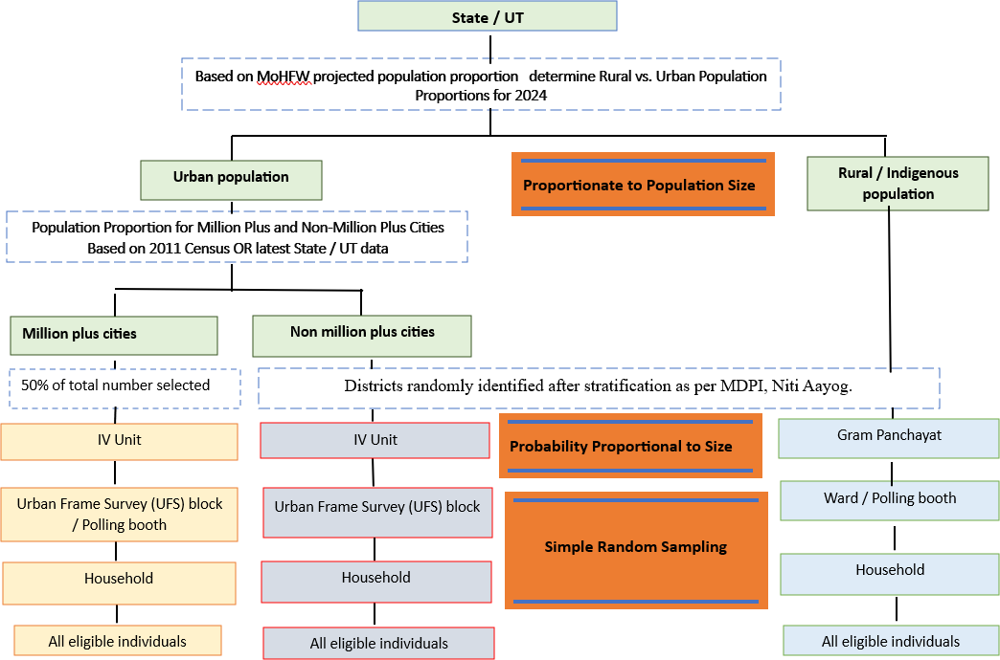

# **Introduction**

Due to time constraints, there was an immediate need for clean and accurate sample selection from a high-volume dataset. This requirement led to the development of this application. Sampling had to be carried out for all the States and Union Territories, further stratified into **Rural** and **Urban** segments, as per the sampling strategy flowchart shown below.

<br>

```{=html}
<div style="text-align: center;">
  
  <p style="font-style: italic; font-weight: bold; text-align: center; margin-top:10px ">
    The overall study design
  </p>
</div>
```

<br>

For a specific State, once the districts where the survey is to be conducted are finalized:

-   **For the Rural population:**\
    The list of **Gram Panchayats (GP)** under each selected district was obtained from the **Jal Jeevan Mission** portal ([JJM Reports](https://ejalshakti.gov.in/JJM/JJMReports/BasicInformation/JJMRep_RWS_RuralPopulation.aspx)), which provides projected population sizes of SC, ST, and General categories based on the 2011 census. The issue with the JJM reports was that the GP data was provided as separate spreadsheets (.xls) at the development block level according to the administrative system, rather than as a single list for each district. Therefore, the first phase of GP selection involves merging several block‑level data files into one consolidated list using the function <code style="color:red;">TableCooker</code> of **PPS.xlsm**, in order to obtain the projected total rural population of each selected district within a state for calculating the number of clusters and Probability proportional size was adopted for the selection of clusters on each district.

-   **For the Urban population:**\
    According to the study design, the Urban population was further divided into **Million Plus (MP)** and **Non‑Million Plus (NMP)** cities. The application was developed to handle only NMP cities, while MP cities were managed manually without any automation. Therefore, this documentation focuses solely on the NMP cities. Sampling was carried out using **Urban Frame Sampling (UFS)** block‑level data obtained from the Ministry of Statistics and Programme Implementation website ([UFS metadata](https://mospi.gov.in/ufs-metadata)), which provides state‑wise UFS block data. The important definitions related the UFS metadata is provided in the below PDF (pg.no: 2).

<br><br>

```{=html}
<div style="text-align: center;">
<iframe src="UFS.pdf" width="80%" height="400px">
</iframe>
</div>
```

<br><br>
<div align="center">

| Term | Definition (Summary) |
|----|----|
| **House** | Any structure, tent, or shelter used for residential, non‑residential, or both purposes; it may also be vacant. |
| **Household** | A group of people normally living together and sharing a common kitchen; members may or may not be related by blood. |
| **Block** | The ultimate unit of enumeration in UFS; a compact area bounded by natural or permanent landmarks. Each typically contains \~120–150 households. A block is bounded by well‑defined, clear‑cut, natural boundaries to the extent possible. Blocks are mutually exclusive and exhaustive, so that all blocks in a town together cover the town’s total area. **(Equivalent to a village in rural areas)** |
| **Investigator Unit (IV Unit)** | An intermediate unit between a town and its blocks; consists of \~20–40 UFS blocks and, where available, follows ward boundaries. **(Equivalent to a Gram Panchayat in rural areas)** |
</div>
<br>

Each district in the urban scenario has several IV units, similar to Gram Panchayats (GP) in rural areas. However, as per the definitions above, in reality some IV units were not valid—i.e., in certain cases, we found IV units with fewer than 20 UFS blocks. Hence, these IV units were excluded when preparing the number of IV units for each district during the PPS calculation and cluster allocation process.

On the other hand, in some cases, the exclusion of IV units due to an insufficient number of UFS blocks led to the exclusion of an entire selected district especially in NMP cites. This serious issue was managed by slightly tweaking the program: in such cases, the “excluder” was turned off, allowing clusters to be selected repeatedly from the same limited IV units. **In other cases, the rule was maintained—choosing only one cluster (i.e., UFS blocks) from which 25 adults and 10 adolescents would be selected in each cluster, similar to the approach used in villages, which serve as clusters in rural areas.**

To address the infeasibility caused by the identification of ST populations in rural scenario and inaccessible UFS blocks in urban scenario or not able to achieve the target of 25 adults and 10 adolescents, more than one selection list (i.e., 3) of clusters was provided to the field data collectors. They were instructed to follow only one list under normal circumstances and use the other list in exceptional situations. they can use the other list to choose another cluster belong to the same Gram Panchayat or IV unit.
